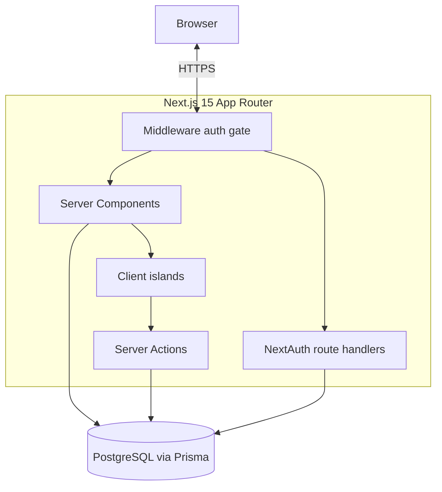
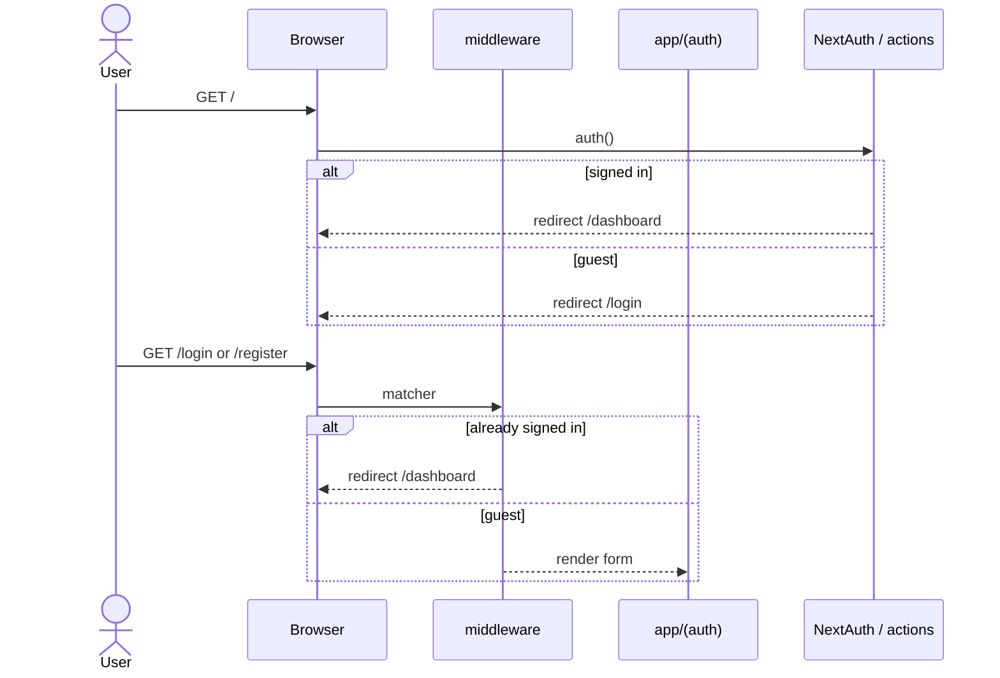
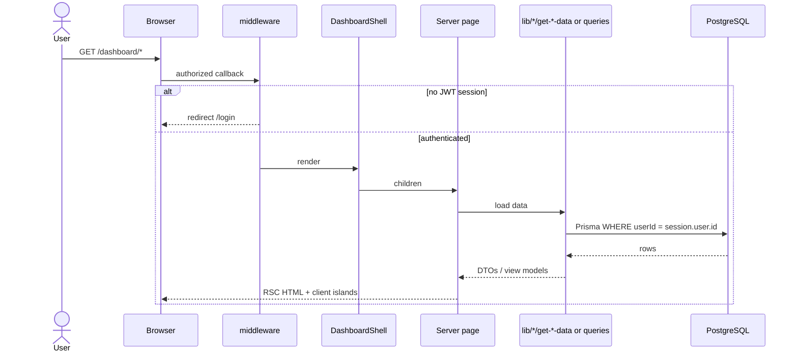
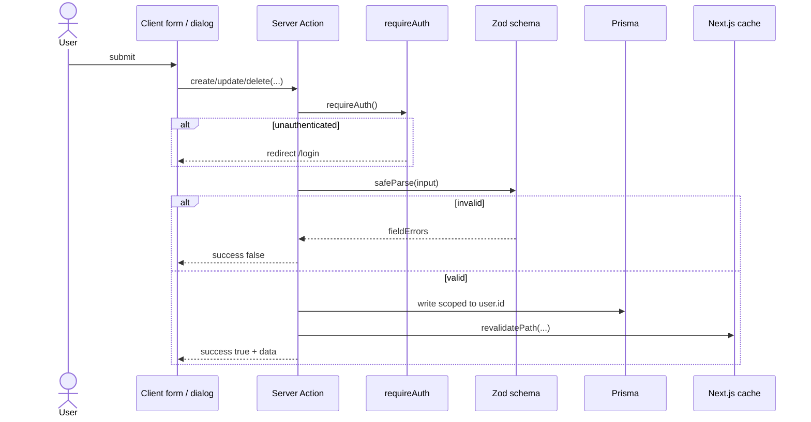
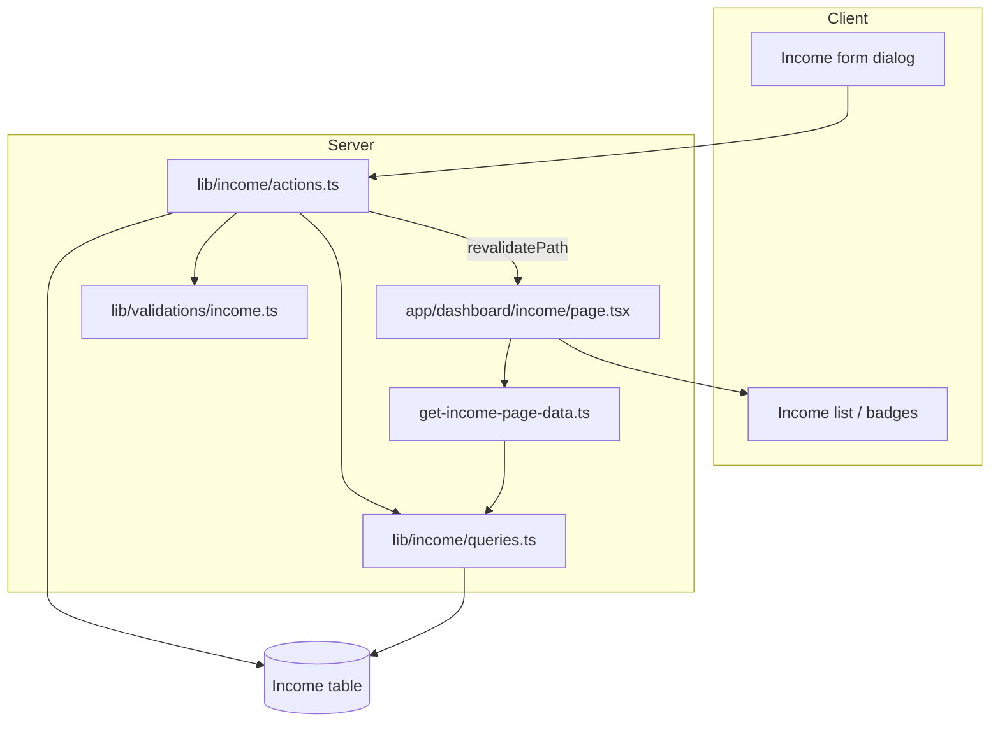
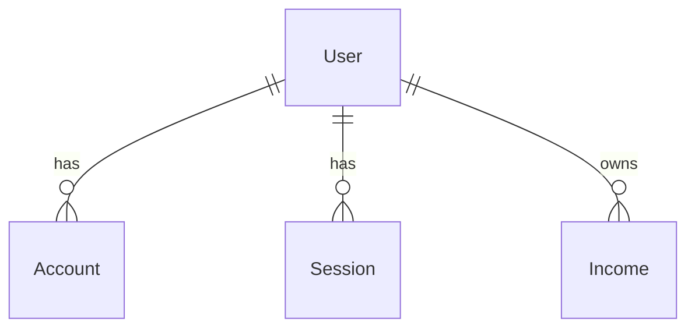
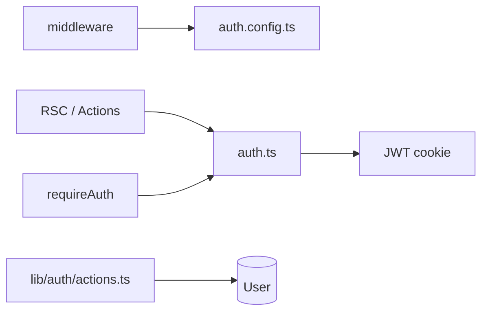

# Architecture

**Product:** Expense & Salary Manager  
**Last updated:** 2026-09-05

How the system is structured today and how new features should plug in. Design rationale and C4-style views: [SYSTEM_DESIGN.md](./SYSTEM_DESIGN.md). Entity details: [DATA_MODEL.md](./DATA_MODEL.md).

---

## 1. High-level overview



- **No separate backend service** — domain logic lives in `lib/` on the Next.js server.
- **Primary mutation path** — Server Actions (`"use server"`), not REST CRUD APIs.
- **Auth** — NextAuth v5 Credentials provider, JWT sessions, Prisma adapter tables for account/session support.

---

## 2. Runtime & request flow

### 2.1 Public / auth pages



### 2.2 Protected dashboard (read path)



### 2.3 Mutations (write path)



**Action result shape:**

```ts
type ActionResult<T = undefined> =
  | { success: true; data?: T }
  | { success: false; error: string; fieldErrors?: Record<string, string[]> };
```

---

## 3. Income feature data flow



Dashboard home (`lib/dashboard/get-dashboard-data.ts`) aggregates current-month income (expenses currently zero until the expenses module ships).

---

## 4. Layering

| Layer | Responsibility | Location |
|-------|----------------|----------|
| **Routes** | Thin pages, layouts, loading/error UI | `app/` |
| **UI** | Presentational + interactive components | `components/` |
| **Domain** | Queries, actions, calculations, types | `lib/<feature>/` |
| **Validation** | Zod schemas | `lib/validations/` |
| **Auth** | NextAuth config, session helpers | `lib/auth/` |
| **Persistence** | Schema, migrations, Prisma client | `prisma/`, `lib/db/` |
| **Edge gate** | Route protection | `middleware.ts` |

**Dependency direction:** `app` → `components` → `lib` → `prisma` / DB.  
Avoid importing from `app/` into `lib/`. Avoid Prisma calls inside pure UI components.

---

## 5. Feature module pattern

Each feature should follow the income module shape:

```
lib/<feature>/
  actions.ts      # "use server" mutations
  queries.ts      # DB reads (user-scoped)
  types.ts        # Shared TS types
  constants.ts    # Enums / labels
  get-*-data.ts   # Page-level aggregate loaders (optional)
  *.ts            # Helpers (decimal, etc.)

components/<feature>/
  *-page-client.tsx
  *-form-dialog.tsx
  ...

app/dashboard/<feature>/
  page.tsx
  loading.tsx
```

Enable the sidebar entry in `lib/dashboard/navigation.ts` only when the route is usable (`enabled: true`).

---

## 6. Data model (summary)



**Income fields:** `amount` Decimal(12,2), `source`, `type` enum, `date`, `status` enum, `notes?`, `recurring`, timestamps.

Auth-related models (`Account`, `Session`, `VerificationToken`) support the Prisma adapter / NextAuth ecosystem even though the app uses JWT session strategy for Credentials.

Full field tables and planned entities: [DATA_MODEL.md](./DATA_MODEL.md).

---

## 7. Auth architecture

| Piece | Role |
|-------|------|
| `lib/auth/auth.config.ts` | Edge-safe callbacks + pages; used by middleware |
| `lib/auth/auth.ts` | Full NextAuth (adapter, Credentials, JWT/session callbacks) |
| `lib/auth/session.ts` | `requireAuth()` for Server Actions / RSC |
| `lib/auth/actions.ts` | Register / sign-in / sign-out actions |
| `middleware.ts` | Matcher: `/dashboard/:path*`, `/login`, `/register` |
| `types/next-auth.d.ts` | Session user `id` typing |
| `app/api/auth/[...nextauth]` | NextAuth route handlers |

**Rules:** never trust client-supplied `userId`; always take identity from the session.



---

## 8. Frontend architecture

- **Fonts:** Geist Sans / Geist Mono (`app/layout.tsx`).
- **Theme:** `ThemeProvider` (`next-themes`), class-based dark mode.
- **Shell:** `DashboardShell` — desktop sidebar + mobile sheet.
- **Charts:** Recharts under `components/dashboard/charts/`.
- **Toasts:** Radix toast wrappers in `components/ui/`.
- **Forms:** React Hook Form + Zod resolvers on client; Server Actions on submit.

See [DESIGN_SYSTEM.md](./DESIGN_SYSTEM.md) for tokens and UI conventions.

---

## 9. Configuration & ops

| Concern | Approach |
|---------|----------|
| Env | `DATABASE_URL`, `AUTH_SECRET` (see `.env.example`) |
| Scripts | `scripts/run.mjs` wraps local `next` / `eslint` / `prisma` binaries |
| Migrations | `prisma/migrations` via `npm run db:migrate` |
| Lint | ESLint flat config (`eslint.config.mjs`) |
| Deploy (recommended) | Vercel + managed Postgres; set env vars; run migrations in CI/release |

---

## 10. Security model

1. Middleware blocks unauthenticated access to dashboard routes.
2. Server Actions call `requireAuth()` before any mutation.
3. Every query filters by `user.id`.
4. Passwords stored as `passwordHash` only (bcrypt).
5. Secrets never committed; `.env` gitignored.

---

## 11. Extensibility checklist (new feature)

1. PRD: add requirements + status in [PRD.md](./PRD.md).
2. Schema + migration; update [DATA_MODEL.md](./DATA_MODEL.md).
3. `lib/validations` + `lib/<feature>` queries/actions.
4. `components/<feature>` + `app/dashboard/<feature>` page.
5. Wire nav (`enabled: true`).
6. Update dashboard aggregations if the home view should reflect new data.
7. Update [SYSTEM_DESIGN.md](./SYSTEM_DESIGN.md) / this doc if layers or data model change.

---

## 12. Related docs

- [Sources of truth](./SOURCE_OF_TRUTH.md)
- [System design](./SYSTEM_DESIGN.md)
- [Data model](./DATA_MODEL.md)
- [PRD](./PRD.md)
- [Design system](./DESIGN_SYSTEM.md)
- [README](../README.md)
- [AGENTS](../AGENTS.md)
