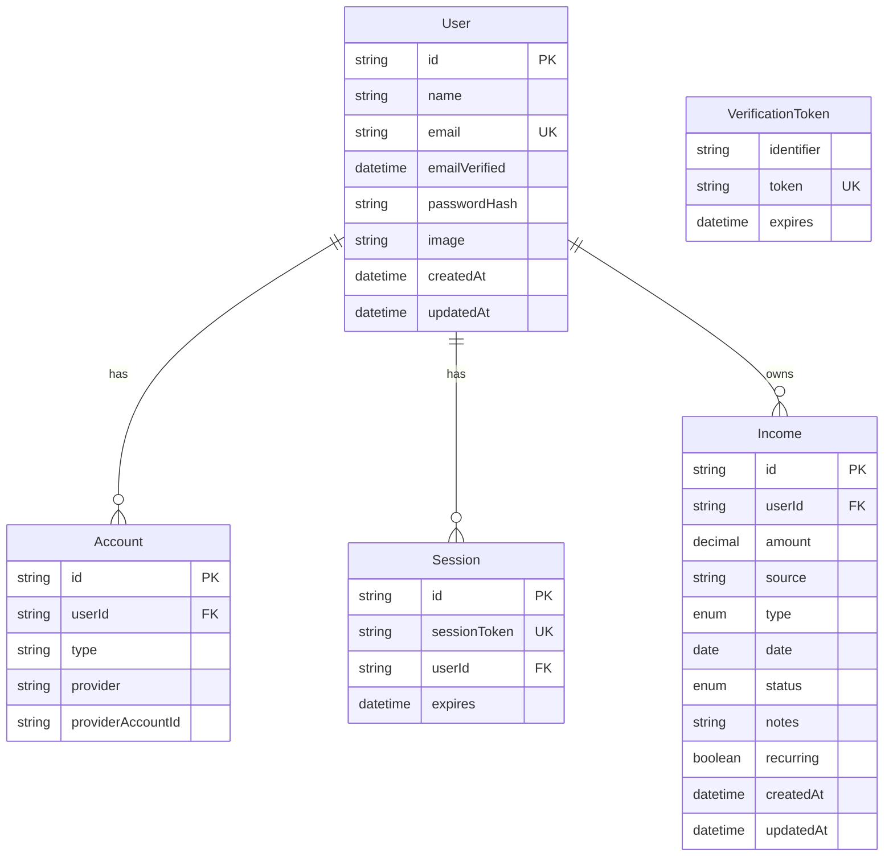
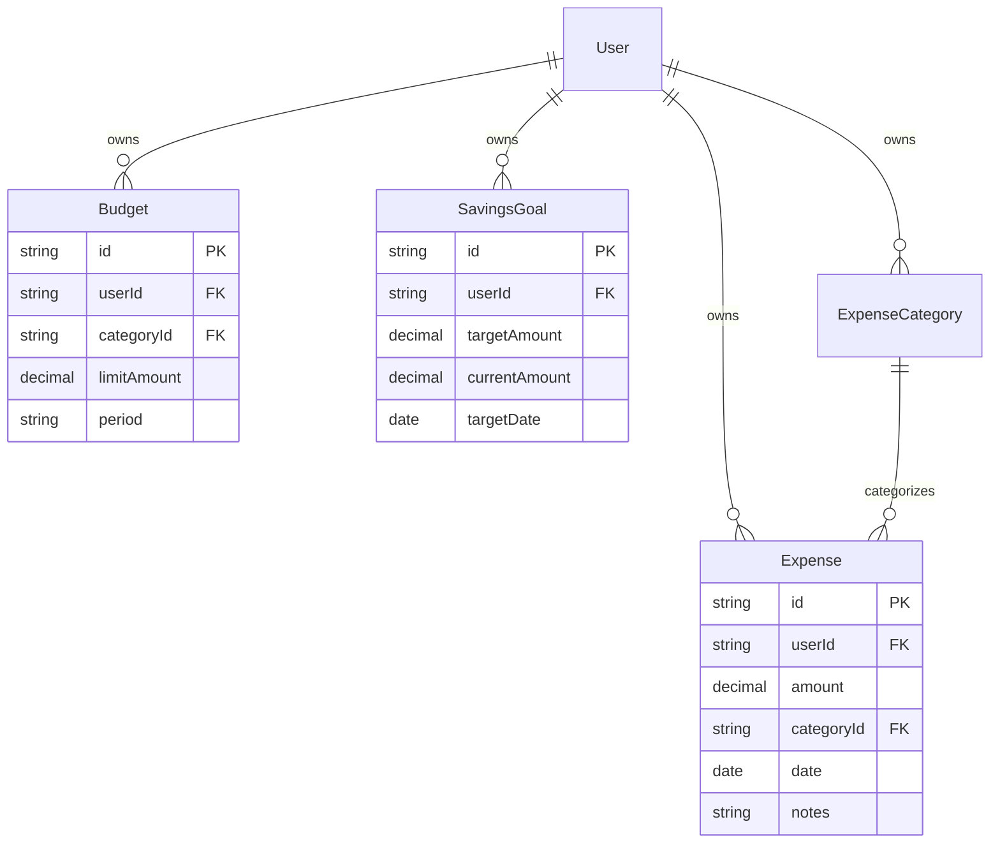

# Data Model

**Product:** Expense & Salary Manager  
**Last updated:** 2026-09-05  
**Authoritative schema:** [`prisma/schema.prisma`](../prisma/schema.prisma)  
**Migrations:** [`prisma/migrations/`](../prisma/migrations/)

If this document and Prisma disagree, **Prisma + committed migrations win** — then update this file.

---

## 1. Entity-relationship diagram (current)

`VerificationToken` is standalone (NextAuth adapter support). App session strategy is **JWT**; `Session` / `Account` tables remain for adapter compatibility.

---

## 2. Enums

### IncomeType

| Value | Meaning |
|-------|---------|
| `SALARY` | Regular employment pay |
| `FREELANCE` | Contract / gig income |
| `BUSINESS` | Business revenue |
| `INVESTMENT` | Dividends, interest, etc. |
| `BONUS` | One-off bonus |
| `OTHER` | Catch-all |

### IncomeStatus

| Value | Meaning |
|-------|---------|
| `RECEIVED` | Money in hand / confirmed |
| `PENDING` | Expected / invoiced / not yet received |

Default for new rows: `PENDING`.

---

## 3. Table details

### User

| Field | Type | Notes |
|-------|------|--------|
| `id` | cuid | PK |
| `name` | string | Display name |
| `email` | string | Unique; indexed |
| `emailVerified` | DateTime? | Adapter field |
| `passwordHash` | string? | bcrypt; never returned to client |
| `image` | string? | Optional avatar URL |
| `createdAt` / `updatedAt` | DateTime | Audit |

### Income

| Field | Type | Notes |
|-------|------|--------|
| `id` | cuid | PK |
| `userId` | string | FK → User, **cascade delete**, indexed |
| `amount` | Decimal(12,2) | Positive; validated in Zod |
| `source` | string | e.g. employer / client name |
| `type` | IncomeType | Enum |
| `date` | Date | Income date (`@db.Date`) |
| `status` | IncomeStatus | Default `PENDING` |
| `notes` | string? | Optional |
| `recurring` | boolean | Flag only; no auto-generation yet |
| `createdAt` / `updatedAt` | DateTime | Audit |

**Indexes:** `[userId]`, `[userId, date]`, `[userId, status]`, `[userId, recurring]`.

### Account / Session / VerificationToken

Standard NextAuth Prisma adapter shapes. Do not store app business data here.

---

## 4. Tenancy rule

Every **user-owned** business table must:

1. Include `userId` referencing `User.id`
2. Use `onDelete: Cascade`
3. Be queried/mutated only with `userId` from `requireAuth()` / session — never from the client body alone

---

## 5. Planned entities (not in schema yet)

Align field styles with Income where sensible (amount Decimal, date, status, notes, `userId`).

Nav placeholders already exist in `lib/dashboard/navigation.ts` (`enabled: false`).

Optional later: unified **Transactions** view (computed union of income + expenses, or a dedicated table).

---

## 6. Money handling

- Store as Prisma `Decimal` / Postgres `NUMERIC(12,2)`
- Format for UI via `lib/format/currency.ts` and helpers in `lib/income/decimal.ts`
- Do not use JavaScript `number` for persisted money math beyond validated parse boundaries

---

## 7. Related docs

- [System design](./SYSTEM_DESIGN.md)
- [Architecture](./ARCHITECTURE.md)
- [PRD](./PRD.md)
- [Sources of truth](./SOURCE_OF_TRUTH.md)
