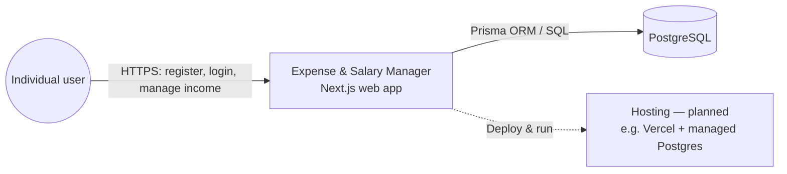
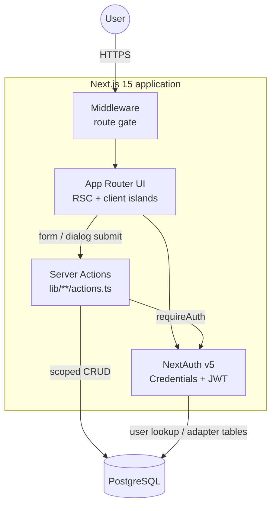
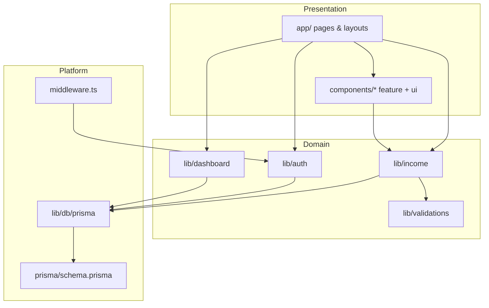
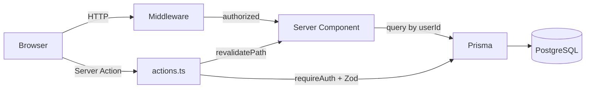
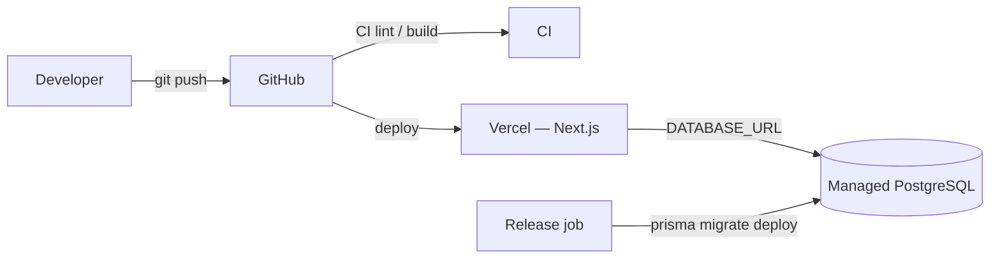

# System Design

**Product:** Expense & Salary Manager  
**Last updated:** 2026-09-05  
**Status:** MVP (auth + income + dashboard); expenses and related modules planned

This document captures **system design decisions**, boundaries, and diagrams. For request-level flows and module checklists, see [ARCHITECTURE.md](./ARCHITECTURE.md). For product scope, see [PRD.md](./PRD.md).

---

## 1. Design goals

| Goal | Design choice |
|------|----------------|
| Fast personal finance UI | Single Next.js app; Server Components for reads |
| Strong tenancy | Every user-owned row scoped by `userId` from session |
| Simple ops | No separate API service; Postgres + one deployable |
| Safe mutations | Server Actions + Zod + explicit `ActionResult` |
| Incremental roadmap | Nav placeholders; ship modules behind `enabled` flags |

---

## 2. Context diagram

Who interacts with the system:



**In scope:** responsive browser clients.  
**Out of scope (MVP):** bank sync, native mobile, shared household accounts, tax engines.

---

## 3. Container diagram

Major runtime pieces inside one Next.js deployable:



There is **no** standalone REST backend. Domain logic runs in the Next.js Node runtime.

---

## 4. Key architectural decisions

| Decision | Choice | Rationale |
|----------|--------|-----------|
| App shape | Monolith Next.js App Router | One repo, one deploy, colocate UI + domain |
| Mutations | Server Actions | Type-safe, no extra API layer for CRUD |
| Auth | NextAuth Credentials + **JWT** | Simple email/password; edge-friendly middleware |
| ORM | Prisma + migrations | Typed models; reviewable SQL history |
| Validation | Zod (client + server) | Shared shape; server is authoritative |
| Money | `Decimal(12,2)` | Avoid float drift |
| UI kit | shadcn/ui (New York, Neutral) | Accessible primitives, token-driven themes |
| Feature rollout | `navigation.ts` `enabled` | Hide unfinished modules without deleting IA |

### Rejected / deferred

| Idea | Status | Why deferred |
|------|--------|--------------|
| Separate Nest/Express API | Rejected for MVP | Extra latency and deploy surface |
| OAuth-only social login | Deferred | Credentials sufficient for private MVP |
| Open Banking / Plaid | Out of scope | Complexity and compliance |
| Multi-currency FX engine | Deferred | Settings later; single currency assumed |

---

## 5. Component view (logical)



**Dependency rule:** `app` → `components` → `lib` → DB. Do not import `app/` from `lib/`.

---

## 6. End-to-end data flow (summary)



Detailed sequence diagrams live in [ARCHITECTURE.md §2–3](./ARCHITECTURE.md).

---

## 7. Security design

```mermaid
flowchart TD
  Req[Incoming request] --> Match{Path matched by middleware?}
  Match -->|/dashboard/*| AuthZ{JWT session valid?}
  AuthZ -->|no| Login[/login]
  AuthZ -->|yes| Page[RSC or Action]
  Match -->|/login or /register| Guest{Already signed in?}
  Guest -->|yes| Dash[/dashboard]
  Guest -->|no| AuthPage[Auth UI]
  Page --> Action{Mutation?}
  Action -->|yes| RA[requireAuth]
  RA --> Zod[Zod validate]
  Zod --> Scope["Prisma where userId = session.user.id"]
  Action -->|no| Read[Prisma read scoped by userId]
```

**Threat mitigations (MVP):**

- Passwords stored as bcrypt `passwordHash` only
- No client-trusted `userId`
- Secrets only via env (`AUTH_SECRET`, `DATABASE_URL`)
- Cascade delete on `User` for owned rows

---

## 8. Data design overview

Current owned entity: **Income**. Auth support tables: Account, Session, VerificationToken.

Planned: Expense (+ categories), Budget, SavingsGoal, RecurringExpense, Settings preferences.

Full ERD and field tables: [DATA_MODEL.md](./DATA_MODEL.md).

---

## 9. Deployment design (recommended)



| Concern | Approach |
|---------|----------|
| App host | Vercel (or any Node host supporting Next.js) |
| Database | Managed Postgres; connection string in env |
| Migrations | Run `prisma migrate deploy` in release/CI — not ad-hoc `db:push` in prod |
| Secrets | Platform env vars; mirror keys in `.env.example` |

---

## 10. Quality attributes

| Attribute | Target / practice |
|-----------|-------------------|
| Confidentiality | Per-user isolation; hashed passwords |
| Integrity | Zod + DB constraints; Decimal money |
| Availability | Stateless JWT app tier; managed DB backups (ops) |
| Maintainability | Feature folders; docs + agent sources of truth |
| UX performance | RSC reads; Turbopack in dev; revalidate after writes |

---

## 11. Extensibility playbook

1. Add requirements to [PRD.md](./PRD.md).
2. Extend schema + migration; update [DATA_MODEL.md](./DATA_MODEL.md).
3. Add `lib/validations` + `lib/<feature>` queries/actions.
4. Add `components/<feature>` + `app/dashboard/<feature>`.
5. Flip `enabled: true` in `navigation.ts`.
6. Wire dashboard aggregates if home should show new metrics.
7. Refresh this doc / [ARCHITECTURE.md](./ARCHITECTURE.md) if boundaries change.

---

## 12. Related docs

- [Sources of truth](./SOURCE_OF_TRUTH.md)
- [Architecture](./ARCHITECTURE.md)
- [Data model](./DATA_MODEL.md)
- [PRD](./PRD.md)
- [Design system](./DESIGN_SYSTEM.md)
- [AGENTS.md](../AGENTS.md)
